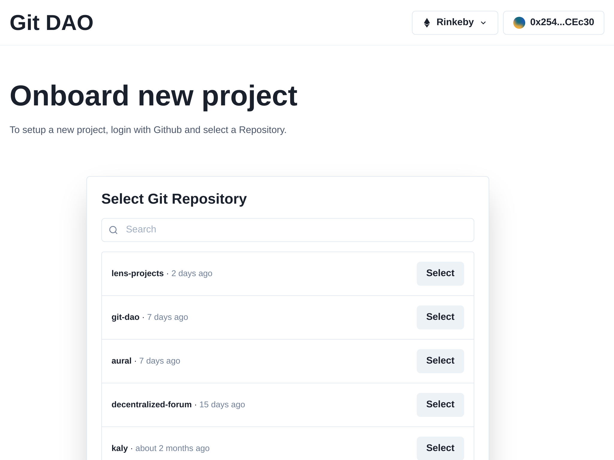
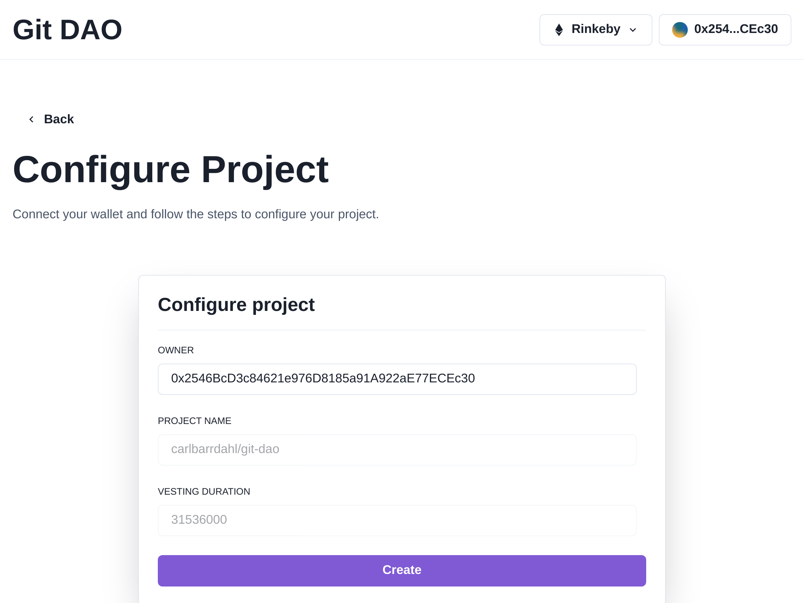

# Git DAO

  
  

An ERC20 token with a fixed supply is created for the repository with a portion minted to the owner. The owner can reward tokens to contributors of the project such as bug reports or solving issues.

This token will initially have 0 value but the creator can create an initial funding of the project themselves by providing tokens + ETH to an AMM like Uniswap. A market is then created around the token and contributors who have been rewarded can swap their tokens to ETH if they choose to (and speculators can buy tokens for ETH).

People who are interested in the project can fund it by simply sending tokens to it. Vesting wallets could be set up with a cliff and vesting period to prevent the owner from withdrawing at all at once. Individual issues could also be funded and added to a bounty pool with payouts in ETH in addition to the tokens.

Information about the token and project can be shown as a badge or a chart, either in the repo README or on a website. This could include what addresses hold how many tokens and how funded the project is.

This token can also be used in Governance where the community votes for proposals. A proposal could for example be transfering of funds to contributors as rewards.

GitHub provides an amazing interface for browsing code, issues, pull requests, project boards etc and users are familiar with it. This idea is utilizing Github as an interface and combining with a layer of smart contracts to create a hybrid app. In the future something like Radicle could be used to move towards more decentralization.

### How does it work?

1. Sign in with Github to see what repos the user has access to
2. Send repo to smart contract which creates an ERC20 token with 1M supply and mints 10k to owner (1% of all tokens)
3. A signed hash is used to verify the repo is owned by the user calling the contract
4. The owner can optionally supply their tokens to Uniswap with ETH to create initial market (1 ETH at $3000 + 10k tokens would create a market cap of $300 000)
5. People can participate by contributing with code, bug reports or other ways to create value to the project and be rewarded in tokens for their work.
6. People or companies can fund the project or even specific issues to help with prioritization

This project is being built to bootstrap itself using this idea.

If you want to participate in any way please join the https://github.com/carlbarrdahl/git-dao/discussions!

---

Inspired by Balaji Srinivasan's Tweet:  
https://twitter.com/balajis/status/1326313315044192256?lang=en

Also mentioned in:  
DappCamp X Balaji Srinivasan - Open Problems in Crypto Infrastructure  
https://www.youtube.com/watch?v=l2VQkbucXns
